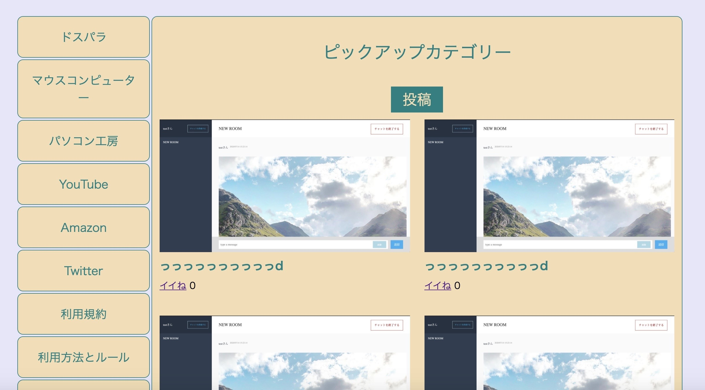

## アプリケーション名
- aaaaaa

## 概要
- おすすめオンラインゲームの記事を投稿できる
- 投稿された記事にコメントができる
- 投稿された記事にいいねができる
- ユーザーの登録ができる

## 本番環境

## 制作背景（意図）
- 私はPCオンラインゲームが好きなのですが、一番最初にPCを買うときにやりたいオンラインゲームで出来るパソコンはどれだろうかと探すのが大変だった思い出があります。色々なオンラインゲームが載っているサイトなどを見にいった時にオンラインゲームの情報は載っているのですが、おすすめのPC情報なども載っているサイトがないなと思い作りました。

## DEMO
#トップページ

## 工夫したポイント
- 投稿された記事にコメントができる
- 投稿された記事にいいねができる
- 記事を見て動画など見たくなったら動画サイトのリンクをつけた
- おすすめのパソコンサイトにいくリンクをつけた

## 使用技術（開発環境）

# バックエンド
Ruby,Ruby on Rails

# フロントエンド
